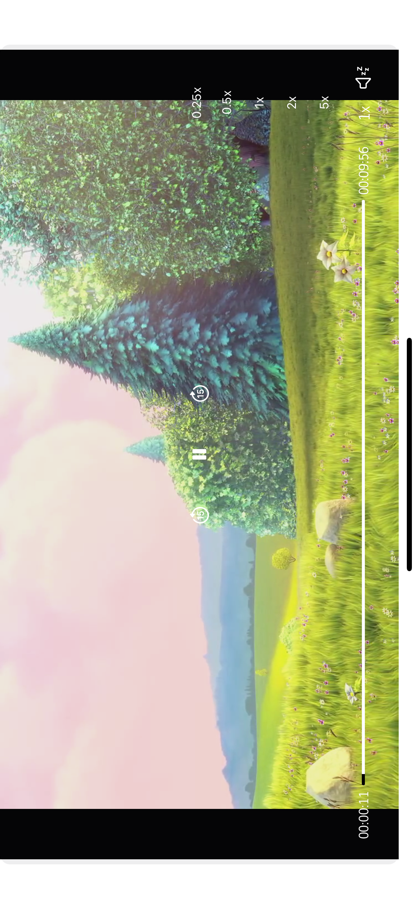

# JMVideoPlayer
created video player with custom controllers play pause and loading and speed control.And usage is very simple 
In screen where u want to display give the View subclass name as JMVideoplayer
and create reference like below
    **@IBOutlet weak var videoPlayer:JMVideoPlayer!**
    and just provide the link of video like below
    
**    videoPlayer.videoLink = "http://commondatastorage.googleapis.com/gtv-videos-bucket/sample/BigBuckBunny.mp4"
**
And play the video **videoPlayer.playVideo()**.
Here u can customise the player images and loader images how ever u wnat.

**Note: Here u can able to play only one Video not list of videos in Up coming project i will post with multiple video how to do.
**
 

